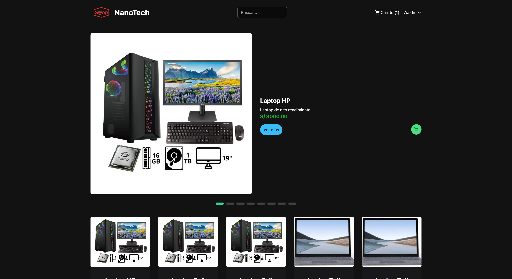

### Índice

- [Descripción del proyecto](#Descripción-del-proyecto)
- [Desplegar el proyecto](#Desplegar-el-proyecto)
- [Funcionalidades del proyecto](#Funcionalidades-del-proyecto)
- [Acceso al proyecto](#Acceso-al-proyecto)
- [Tecnologías utilizadas](#Tecnologías-utilizadas)
- [Autores](#Autores)

## Descripción del proyecto

Ecommerce de productos electronicos. Proyecto desarrolado para el Curso de Ingenieria de Software.

## Desplegar el proyecto

1. Clonar el repositorio
2. Instalar las dependencias `npm install`
3. Clonar el archivo .env.template a .env y configurar las variables de entorno
4. Ejecutar el proyecto con `npm run start`

## Funcionalidades del proyecto

- Login y registro de usuarios
- Carrito de compras

## Acceso al proyecto

- [Demo](enlace)
- [API](https://nanotechstore.store/backend/public/api)

## Tecnologías utilizadas

- Angular
- Tailwind
- PrimeNG

## Autores

| [ Waldir Maidana ](https://github.com/zidjian) |
| :------------------------------------------------------------------------------------------------------------------: |
